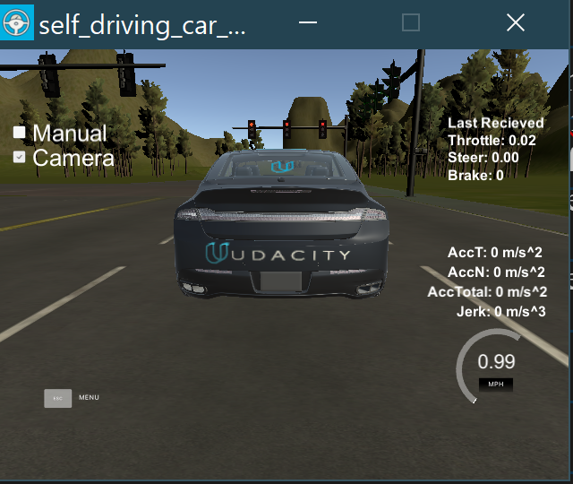

# CarND-Capstone
This is the project repo for the final project of the Udacity Self-Driving Car Nanodegree: Programming a Real Self-Driving Car. For more information about the project, see the project introduction [here](https://classroom.udacity.com/nanodegrees/nd013/parts/6047fe34-d93c-4f50-8336-b70ef10cb4b2/modules/e1a23b06-329a-4684-a717-ad476f0d8dff/lessons/462c933d-9f24-42d3-8bdc-a08a5fc866e4/concepts/5ab4b122-83e6-436d-850f-9f4d26627fd9).

## Setting up:
You have the three options for setting up this project: Virtual Machine, Native Installation and docker. 
If you are running a windows machine like me, I would recommend using docker. Windows wsl2 (Windows Subsytem Linux) has tight integration with Docker Desktop which makes for a delightful development experience. 
I will be going over how I used docker to get started. If you want to use any of the other two options, please refer [here](https://github.com/udacity/CarND-Capstone/blob/master/README.md).

### Steps:
1. Get [wsl2](https://docs.microsoft.com/en-us/windows/wsl/install-win10) on your windows machine.
2. Install [Docker Desktop](https://www.docker.com/products/docker-desktop).
3. Although not necessary, I would highly recommend getting [vscode](https://code.visualstudio.com/) and installing the [docker extension](https://marketplace.visualstudio.com/items?itemName=ms-azuretools.vscode-docker) and [remote development extension pack](https://marketplace.visualstudio.com/items?itemName=ms-vscode-remote.vscode-remote-extensionpack). This would allow you to explore subystem directories, launch containers, mount directories and do a lot more right from your code editor.
4. Get the [code](https://github.com/nturumel/CarND-Capstone) and the [simulator](https://github.com/udacity/CarND-Capstone/releases).
5. Open wsl2 bash terminal.
6. Run: 
```bash 
    docker pull redherring2141/carnd-capstone
```
 to get the docker necessary image.

7. `cd` into the project directory. 
8.  Run  (might want to create a script for this):
```bash
    docker run -p 4567:4567 -v {pwd}:/capstone -v /tmp/log:/root/.ros/  --name={container_name} --rm -it    redherring2141/carnd-capstone:latest
```
9. If you want to set up another terminal, simply run:
```bash
    docker exec -it <container name>
    source /root/ros_entrypoint.sh 
 ```
11.  `cd` into the ros directory of the container and run the following to launch the project:
```bash
    catkin_make
    source devel/setup.sh
    roslaunch launch/styx.launch
```
12.  Start the simulator, turn off *manual* and start the *camera*.    


## Problem Statement:
The goal of this project is to get a car to successfully navigate itself around a predefined path. There are two programmable modules at play, the behavior planner and the perception module. Since the path has already been laid out, we do not have a trajectory planner. The trajectory data comes in the form of a list of waypoints instead.

The raw camera feed is analyzed by the perception, which scans for traffic lights, road signs or any other obstacles in the vehicle's path. The data generated by perception is read by the behavior planner, which picks the appropriate action for the car, i.e. whether it should accelerate, decelerate or stop.   

The behavior planner for this project only decides what the next set of waypoints for the car should be, and what the approaching velocity for those waypoints should be. The car is equipped with the **drive by wire** feature, which acts as the control module. It reads in the data communicated by the behavior module and performs the actual driving.

There are two tracks in the simulator.
* A highway test track with traffic lights.
* A testing lot test track.

For those enrolled in the Udacity self-driving nanodegree, there is an opportunity to have your code drive on Carla (Udacity's very own self driving car). The testing lot track is set up resemble the environment that Carla will be tested under. 

## Project Structure:


| Module                                 	| Node                  	| User Programmable  	| Publishing Topics 	| Subscribing Topics 	|
|----------------------------------------	|-----------------------	|--------------------	|-------------------	|--------------------	|
| ros/src/camera_info_publisher/          	| camera_info_publisher 	| No                 	| camera_info       	| ---                	|
| ros/src/tl_detector/ 	| tl_publisher          	| Yes                	| /traffic_waypoint 	| /current_pose, /image_color, /base_waypoints|
| ros/src/twist_controller/     	        | DBWNode               	| Yes                	| /vehicle/dbw_enabled, /twist_cmd, /current_velocity 	| /vehicle/brake_cmd , /vehicle/throttle_cmd, /vehicle/steering_cmd	|
|ros/src/waypoint_follower/|pure_pursuit    |No |/twist_cmd                                       |/final_waypoints, /current_pose, /current_velocity|
|ros/src/waypoint_loader/  |waypoint_loader |No |---                                           |/base_waypoints                                   |
|ros/src/waypoint_updater/ |waypoint_updater|Yes|/base_waypoints, /current_pose, /traffic_waypoint|/final_waypoints                                  |

### Nodes:
#### **1. Traffic Light Detection Node:**
This node identifies traffic lights in the vehicle's path. When using the simulator, you get a list containing the configuration of the traffic lights in the track. You also get a list of the base waypoints which describe the path. The node is also aware of the current position of the vehicle. You can combine all of the aforementioned information to figure out what the waypoint of an approaching traffic light is.
You can use a KD Tree for that purpose:
```python
def waypoints_cb(self, waypoints):
        self.waypoints = waypoints
        # make a KD tree
        if not self.waypoints_2d:
            self.waypoints_2d = [[waypoint.pose.pose.position.x, waypoint.pose.pose.position.y] for waypoint in waypoints.waypoints]
            self.waypoint_tree = KDTree(self.waypoints_2d)
```
```python
 car_current_waypoint = self.get_closest_waypoint(self.pose.pose.position.x, self.pose.pose.position.y)

            #TODO find the closest visible traffic light (if one exists)
            # each stop line maps to the traffic light with sam index
            diff = len(self.waypoints.waypoints)
            for i, light in enumerate(self.lights):
                stop_line = stop_line_positions[i]
                stop_line_waypoint = self.get_closest_waypoint(stop_line[0], stop_line[1])
                
                # Calculate and compare the distance
                d = stop_line_waypoint - car_current_waypoint
                if 0 <= d < diff:
                    diff =  d
                    closest_light = self.lights[i]
                    light_wp_idx = stop_line_waypoint
```
#### **2. Waypoint Updater Node:**
This node generates a list of waypoints for the vehicle to follow, It first loads in the route waypoints, the vehicles current position and traffic light information. Based in that information, it generates a list of waypoints that lie ahead of the vehicle, and assign each waypoint with a specific velocity to control the car's speed. There are a few "global" parameters that determine things like the number of waypoints returned, the deceleration rate, the buffer between the light and the vehicle, etc. The publishing rate determines how frequently the output is generated.
```python
MAX_DECEL = 0.5
LOOKAHEAD_WPS = 100 # Number of waypoints we will publish. You can change this number
CONST_DECEL = 1 / LOOKAHEAD_WPS # Deceleration constant for smooth breaking
PUBLISHING_RATE = 20
STOP_LINE_MARGIN = 4 # Padding between stopline and the car's center
```  
It becomes important to be able to quickly localise the car on the route map, and a KD Tree is a handy tool for that:
```python
 self.base_Way_Points = waypoints 
        #rospy.loginfo(self.waypoints_2d)
        if not self.waypoints_2d:
            self.waypoints_2d = [[waypoint.pose.pose.position.x, waypoint.pose.pose.position.y] for waypoint in waypoints.waypoints]
            self.waypoint_tree = KDTree(self.waypoints_2d)
        
```
We can use the hyperplane equation to get the next closest waypoint: 
```python
def get_closest_waypoint_idx(self):
        x = self.pose.pose.position.x
        y = self.pose.pose.position.y

        closest_idx = self.waypoint_tree.query([x,y], 1)[1]

        # Hyperplane fun to see if point is ahead or not
        closest_coord = self.waypoints_2d[closest_idx]
        prev_coord = self.waypoints_2d[closest_idx - 1]
        cl_vect = np.array(closest_coord)
        prev_vect = np.array(prev_coord)
        pos_vect = np.array([x,y])
        val = np.dot(cl_vect - prev_vect, pos_vect - cl_vect)

        if val > 0:
            closest_idx = (closest_idx + 1) % len(self.waypoints_2d)

        return closest_idx
```
In case the vehicle is approaching a traffic light, I slow it down with a combination of linear and quadratic deceleration,
```python
def generate_lane(self):
        lane = Lane()
        
        closest_idx = self.get_closest_waypoint_idx()
        farthest_idx = closest_idx + LOOKAHEAD_WPS
        base_Way_Points = self.base_Way_Points.waypoints[closest_idx:farthest_idx]
    
         
        rospy.logwarn( "current={}, farthest={}, stop={}".format(closest_idx, farthest_idx, self.stop_wp_idx))
        if (self.stop_wp_idx >= farthest_idx or self.stop_wp_idx < closest_idx):
           rospy.logwarn('traffic light is further than the farthest waypoint')
           lane.waypoints = base_Way_Points
        else:
            rospy.logwarn('red light close, decelerate')
            lane.waypoints = self.decelerate_waypoints(base_Way_Points, closest_idx)
        
        return lane

    
    def decelerate_waypoints(self, waypoints, closest_idx):
        temp =[]
        for i, wp in enumerate(waypoints):
            
            p = Waypoint()
            p.pose = wp.pose

            stop_idx = max(self.stop_wp_idx - closest_idx - STOP_LINE_MARGIN, 0) # stopping a couple of waypoints before the end
            dist = self.distance(waypoints, i, stop_idx)
            vel = math.sqrt(2 * MAX_DECEL * dist) + (i * CONST_DECEL)

            if vel < 1:
                vel = 0.
            
            p.twist.twist.linear.x = min(vel, wp.twist.twist.linear.x)
            temp.append(p)
        return temp
```
#### **3. DBW Node:**
This node acts as part of the control module of the vehicle. It takes in the current velocity and requested velocity in the form of rostopics '/current_velocity' and '/twist_cmd'. The node, with the help of a PID controller, a Yaw controller and a lowpass velocity filter determines what the steering, break and throttle of the vehicle should be. It is turned off by default and is enabled by the '/dbw_enabled' rostopic. '/dbw_enabled' is set to true when the simulator is not run on manual. 

```python
def control(self, proposed_velocity, proposed_angular_velocity, current_velocity, dbw_enabled):
        # TODO: Change the arg, kwarg list to suit your needs
        # Return throttle, brake, steer
        if not dbw_enabled:
            self.throttle_controller.reset()
            return 0, 0, 0
        #steering
        steering = self.yaw_controller.get_steering(proposed_velocity, proposed_angular_velocity, current_velocity)
        error = proposed_velocity - current_velocity 
        
        # brake and throttle
        current_time = rospy.get_time()
        delta_t = current_time - self.time
        self.time = current_time
        throttle = self.throttle_controller.step(error, delta_t)
        brake = 0

        if proposed_velocity == 0 and current_velocity < 0.1: # need to stop
            # set throttle to zero and brake to max
            throttle = 0
            brake = MAX_BRAKE 

        elif throttle < 0.1 and error < 0: # need to slow down
            # set throttle to zero and calculate the break
            throttle = 0
            # FIXME: needs to replaced by fuel left
            vehicle_mass  = self.param_data['vehicle_mass'] + GAS_DENSITY * self.param_data['fuel_capacity']  
            decel = min(error, self.param_data['decel_limit'])
            brake = abs((vehicle_mass) * self.param_data['wheel_radius'] * (error / delta_t))


        return throttle, brake, steering
```
## Challenges:
Due to the asynchronous natre of ROS, each node gets initialized and begins processing at its own accord, so often, a node may try to work through data that is either outdated or unavailable. One way to avoid it is to use conditions like `if {some_entity} not None:` and proceed once the field has been populated. The other is to use ros wait for message, eg. `os::topic::waitForMessage("/path_planned/edge", create_path);`.
## Results:
The car is able to navigate safely across the track.

## Future Todo's:
Implement Object Detection and Traffic sign Classifier. This will enable the code to be used in actual vehicles. 
